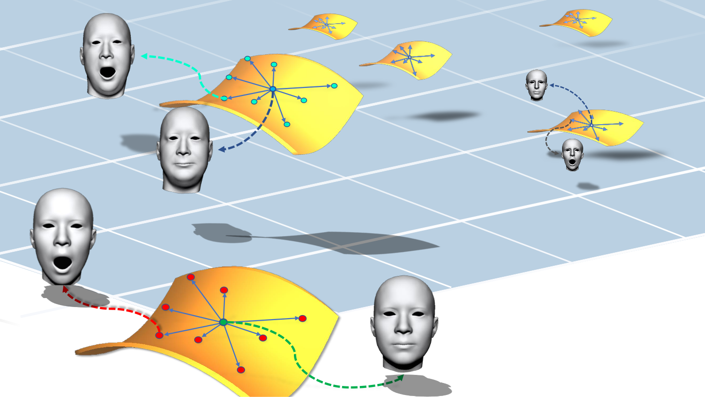
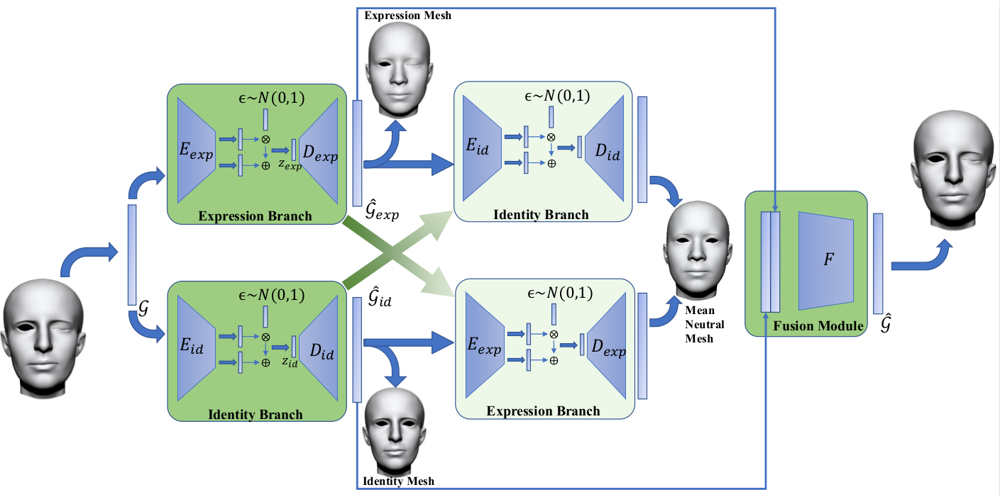
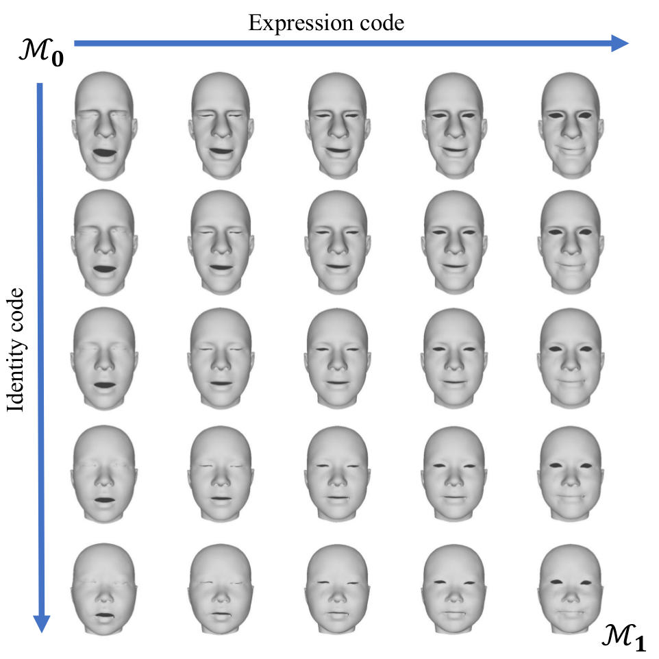

# DR learning for 3D face

this repo is the implementation of our CVPR 2019 paper [Disentangled Representation Learning for 3D Face Shape](https://arxiv.org/abs/1902.09887)

Authors: [Zihang Jiang](home.ustc.edu.cn/~jzh0103/) [Qianyi Wu](https://wuqianyi.top/), [Keyu Chen](https://kychern.github.io/) and [Prof. Juyong Zhang](http://staff.ustc.edu.cn/~juyong/) .

# Our framework

# Usage

### dataset
download [FaceWareHouse(FWH) dataset](http://kunzhou.net/zjugaps/facewarehouse/)

### requirements

tensorflow-gpu = 1.9.0
Keras = 2.2.2

use [get_dr](https://github.com/QianyiWu/get_dr_py) to generate DR feature for each obj file and change the data_path and data_format in `src/data_utils.py`

To recover mesh from DR feature, you need to compile [get_mesh](https://github.com/QianyiWu/get_mesh_py_API), and replace the `get_mesh.cpython-36m-x86_64-linux-gnu.so` in `src` folder.

Also, python version of [libigl](https://github.com/libigl/libigl) is needed for mesh-IO and you need to replace the `pyigl.so` in `src` folder

After all requirements are satisfied, you can use following command to train and test the model.
### training 

run `python src/data_utils.py` to generate training and testing data for 3D face DR learning

>if you train the model on your own dataset(for which topology is different from FWH mesh), you have to recompute `Mean_Face.obj` and all 47 expressions on mean face as mentioned in our paper and regenerate the `FWH_adj_matrix.npz` in `data/disentagle` folder using `src/igl_test.py`
>
>we will add scripts for computation of mean_face and method of interpolation mentioned in our paper soon

run `python main.py -m gcn_vae_id -e 20` to pretrain identity branch

> once you have the interpolated data in `data/disentangle/Interpolated_results` you can uncomment  `net.special_train(epoch)` at line 115 in `main.py` to enable use of data augment

run `python main.py -m gcn_vae_exp -e 20` to pretrain expression branch

run `python main.py -m fusion_dr -e 20` for end_to_end training the whole framework

### testing
simply add `-l -t` to test on each branch and the whole framework like `main.py -m fusion_dr -l -t`

> we provided our pretrained model on [Google Drive](https://drive.google.com/open?id=1LxxNY7wbjMXwrRdYJ4hJfXhg9ETAyIuQ)

### evaluation
The `measurement.py` and `STED` folder is for computation of numerical result mentioned in our paper.

# result examples

# Environment Tests
Currently we have fully tested this package on Ubuntu 16.04 LTS environment with CUDA 9.0. Windows and MacOS are not ensured working.

# Citation
Please cite the following papers if it helps your research: 

<a href="https://arxiv.org/abs/1902.09887">Disentangled Representation Learning for 3D Face Shape</a>

    @inproceedings{Jiang2019Disentangled
          title={Disentangled Representation Learning for 3D Face Shape},
          author={Jiang, Zi-Hang and Wu, Qianyi and Chen, Keyu and Zhang, Juyong}
          booktitle={IEEE Conference on Computer Vision and Pattern Recognition (CVPR)},
          year={2019},
    }
